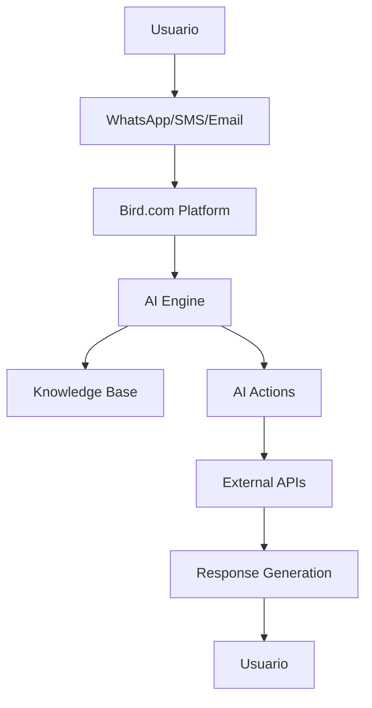

# 📊 Informe Completo: API de Bird.com AI Employees y Extensión Multimodal

## 📋 Resumen Ejecutivo

Este informe presenta un análisis detallado de la arquitectura de integración de Bird.com AI Employees y propone una estrategia integral para extender sus capacidades hacia agentes multimodales que puedan procesar archivos de audio e imágenes por WhatsApp.

### Objetivos del Informe
- Sintetizar la API completa de Bird.com AI Employees
- Analizar las capacidades actuales de integración
- Proponer arquitectura para procesamiento multimodal
- Definir roadmap de implementación
- Establecer métricas de éxito

---

## 🏗️ Arquitectura Actual de Bird.com

### Componentes Principales

```yaml
Bird.com Platform:
  Core Engine:
    - AI Engine (NLP/NLU Processing)
    - Context Manager
    - Action Executor
    - Response Generator
  
  Integration Layer:
    - Authentication (API Keys, HMAC-SHA256)
    - Rate Limiting (1000 req/min API, 100 req/min user)
    - Request Routing
    - Response Transformation
  
  External Systems:
    - KOAJ Catalog API (https://api.neero.link/v1)
    - WhatsApp Business API
    - Custom Webhooks
    - CRM Systems
```

### Flujo de Datos Actual



---

## 🔌 API de Integración Detallada

### 1. Endpoints Especializados

#### Búsqueda Inteligente con AI
```json
POST /bird/ai-search
{
  "query": "vestido negro elegante",
  "context": {
    "user_id": "user_123",
    "conversation_id": "conv_abc",
    "preferences": {
      "style": "elegant",
      "budget": "medium",
      "size": "M"
    },
    "conversation_history": [
      {
        "role": "user",
        "content": "Busco algo elegante",
        "timestamp": "2025-01-27T10:30:00Z"
      }
    ]
  },
  "filters": {
    "category": "PRENDAS/MUJER/VESTIDOS",
    "color": "negro",
    "price_range": {
      "min": 100000,
      "max": 500000
    }
  },
  "options": {
    "limit": 5,
    "include_images": true,
    "include_inventory": true,
    "language": "es"
  }
}
```

#### Recomendaciones Personalizadas
```json
POST /bird/recommendations/smart
{
  "user_context": {
    "user_id": "user_123",
    "preferences": {
      "style": "casual",
      "colors": ["azul", "negro"],
      "size_preference": "M"
    },
    "purchase_history": [
      {
        "product_id": "SKU001",
        "purchase_date": "2025-01-15",
        "amount": 250000
      }
    ],
    "browsing_behavior": {
      "viewed_categories": ["vestidos", "blusas"],
      "session_duration": 1800
    }
  },
  "recommendation_type": "personalized",
  "options": {
    "limit": 4,
    "diversity_factor": 0.7,
    "include_trending": true,
    "personalization_weight": 0.8
  }
}
```

#### Gestión de Inventario
```json
GET /inventory/{sku}
Response:
{
  "sku": "SKU001",
  "available": true,
  "quantity": 15,
  "stores": [
    {
      "store_id": "STORE001",
      "name": "Centro Comercial Santafé",
      "quantity": 8
    }
  ],
  "online_stock": 7
}

POST /inventory/bulk-check
{
  "skus": ["SKU001", "SKU002", "SKU003"],
  "include_stores": true,
  "store_id": "STORE001"
}
```

### 2. Webhooks y Eventos

#### Eventos Salientes (Bird → External)
```json
// conversation.started
{
  "event_id": "evt_123456789",
  "event_type": "conversation.started",
  "timestamp": "2025-01-27T10:30:00Z",
  "data": {
    "conversation_id": "conv_abc123",
    "channel": "whatsapp",
    "user": {
      "id": "user_xyz789",
      "phone": "+57301234567",
      "name": "María García",
      "is_new": false,
      "metadata": {
        "segment": "vip",
        "last_purchase": "2025-01-15"
      }
    },
    "context": {
      "entry_point": "qr_code",
      "campaign": "summer_sale",
      "location": "colombia"
    }
  }
}

// ai.action.executed
{
  "event_id": "evt_567890123",
  "event_type": "ai.action.executed",
  "timestamp": "2025-01-27T10:31:10Z",
  "data": {
    "conversation_id": "conv_abc123",
    "action": {
      "name": "search_products",
      "parameters": {
        "query": "vestido negro elegante",
        "filters": {
          "category": "PRENDAS/MUJER/VESTIDOS",
          "color": "negro",
          "price_range": {
            "min": 100000,
            "max": 500000
          }
        }
      },
      "result": {
        "success": true,
        "products_found": 5,
        "execution_time": 245
      }
    }
  }
}
```

#### Eventos Entrantes (External → Bird)
```json
// inventory.updated
{
  "event_type": "inventory.updated",
  "timestamp": "2025-01-27T10:35:00Z",
  "data": {
    "products": [
      {
        "sku": "SKU001",
        "old_stock": 15,
        "new_stock": 0,
        "availability": "out_of_stock",
        "store_id": "STORE001"
      }
    ]
  }
}

// price.changed
{
  "event_type": "price.changed",
  "timestamp": "2025-01-27T10:40:00Z",
  "data": {
    "product": {
      "sku": "SKU002",
      "name": "Vestido Negro Elegante",
      "old_price": 350000,
      "new_price": 280000
    },
    "discount_percentage": 20
  }
}
```

---

## 🎯 Propuesta de Extensión Multimodal

### Arquitectura Multimodal Propuesta

```yaml
Multimodal Architecture:
  Input Processing:
    - WhatsApp Media Handler
    - File Type Detection
    - Content Validation
  
  Processing Pipeline:
    - Image Analysis (AWS Rekognition)
    - Audio Transcription (AWS Transcribe)
    - Text Extraction (OCR)
    - Product Matching (Custom ML)
  
  Response Generation:
    - Context-Aware Responses
    - Multimodal Response Formatting
    - Channel-Specific Optimization
```

### 1. Nuevos Endpoints Multimodales

#### Procesamiento de Imágenes
```json
POST /bird/multimodal/process-image
{
  "image_url": "https://wa-media.s3.amazonaws.com/image_123.jpg",
  "context": {
    "user_id": "user_123",
    "conversation_id": "conv_abc",
    "intent": "product_search"
  },
  "analysis_type": "product_identification",
  "options": {
    "extract_text": true,
    "identify_products": true,
    "detect_brands": true,
    "analyze_style": true,
    "detect_colors": true,
    "estimate_size": true
  }
}

Response:
{
  "success": true,
  "analysis": {
    "extracted_text": "vestido negro elegante",
    "identified_products": [
      {
        "sku": "SKU001",
        "confidence": 0.89,
        "similarity_score": 0.92
      }
    ],
    "style_analysis": {
      "style": "elegant",
      "occasion": "formal",
      "season": "all_year"
    },
    "color_detection": ["negro", "blanco"],
    "brand_detection": ["KOAJ"]
  },
  "recommendations": [
    {
      "sku": "SKU002",
      "title": "Vestido Negro Elegante",
      "price": 280000,
      "similarity_reason": "Color y estilo similar"
    }
  ]
}
```

#### Procesamiento de Audio
```json
POST /bird/multimodal/process-audio
{
  "audio_url": "https://wa-media.s3.amazonaws.com/audio_456.m4a",
  "context": {
    "user_id": "user_123",
    "conversation_id": "conv_abc"
  },
  "options": {
    "transcription": true,
    "sentiment_analysis": true,
    "language_detection": true,
    "speaker_identification": false,
    "intent_detection": true
  }
}

Response:
{
  "success": true,
  "transcription": {
    "text": "Busco un vestido negro para una cena elegante",
    "confidence": 0.95,
    "language": "es",
    "duration": 3.2
  },
  "sentiment": {
    "overall": "positive",
    "score": 0.7,
    "emotions": ["excited", "interested"]
  },
  "intent": {
    "primary": "product_search",
    "confidence": 0.89,
    "entities": [
      {
        "type": "product",
        "value": "vestido",
        "position": [8, 15]
      },
      {
        "type": "color",
        "value": "negro",
        "position": [16, 21]
      },
      {
        "type": "occasion",
        "value": "cena",
        "position": [31, 35]
      }
    ]
  }
}
```

### 2. Nuevas AI Actions Multimodales

#### Action para Procesamiento de Imágenes
```json
{
  "action_config": {
    "name": "process_whatsapp_image",
    "display_name": "Procesar Imagen de WhatsApp",
    "description": "Analizar imágenes enviadas por WhatsApp para identificar productos y extraer información",
    "triggers": {
      "message_type": "image",
      "channel": "whatsapp",
      "confidence_threshold": 0.7
    },
    "parameters": {
      "required": ["image_url", "message_id"],
      "optional": ["user_context", "conversation_context", "analysis_preferences"]
    },
    "execution": {
      "endpoint": "https://api.neero.link/v1/bird/multimodal/process-image",
      "method": "POST",
      "headers": {
        "Content-Type": "application/json",
        "X-API-Key": "${API_KEY}"
      },
      "timeout": 10000,
      "retry": {
        "attempts": 3,
        "backoff": "exponential"
      }
    },
    "response_handling": {
      "success_path": "$.analysis",
      "error_path": "$.error",
      "transformation": "format_image_analysis_response"
    }
  }
}
```

#### Action para Procesamiento de Audio
```json
{
  "action_config": {
    "name": "process_whatsapp_audio",
    "display_name": "Procesar Audio de WhatsApp",
    "description": "Transcribir y analizar audio enviado por WhatsApp",
    "triggers": {
      "message_type": "audio",
      "channel": "whatsapp",
      "duration_max": 60
    },
    "parameters": {
      "required": ["audio_url", "duration"],
      "optional": ["language_hint", "user_context", "quality_preferences"]
    },
    "execution": {
      "endpoint": "https://api.neero.link/v1/bird/multimodal/process-audio",
      "method": "POST",
      "headers": {
        "Content-Type": "application/json",
        "X-API-Key": "${API_KEY}"
      },
      "timeout": 15000
    },
    "response_handling": {
      "success_path": "$.transcription",
      "error_path": "$.error",
      "transformation": "format_audio_transcription_response"
    }
  }
}
```

### 3. Nuevos Tipos de Eventos

#### Eventos de Procesamiento Multimodal
```json
// multimodal.image.processed
{
  "event_id": "evt_multimodal_001",
  "event_type": "multimodal.image.processed",
  "timestamp": "2025-01-27T10:35:00Z",
  "data": {
    "message_id": "msg_123",
    "image_url": "https://wa-media.s3.amazonaws.com/image_123.jpg",
    "processing_time": 2.3,
    "analysis": {
      "products_identified": ["SKU001", "SKU002"],
      "extracted_text": "vestido negro elegante",
      "style_detected": "elegant",
      "confidence": 0.89,
      "brand_detected": "KOAJ"
    },
    "response": {
      "type": "product_carousel",
      "products": [
        {
          "sku": "SKU001",
          "title": "Vestido Negro Elegante",
          "price": 280000,
          "similarity_score": 0.92
        }
      ],
      "message": "¡Encontré estos productos similares al que mostraste! 🎯"
    }
  }
}

// multimodal.audio.processed
{
  "event_id": "evt_multimodal_002",
  "event_type": "multimodal.audio.processed",
  "timestamp": "2025-01-27T10:36:00Z",
  "data": {
    "message_id": "msg_456",
    "audio_url": "https://wa-media.s3.amazonaws.com/audio_456.m4a",
    "processing_time": 4.1,
    "transcription": {
      "text": "Busco un vestido negro para una cena",
      "confidence": 0.95,
      "language": "es",
      "duration": 3.2
    },
    "sentiment": {
      "overall": "positive",
      "score": 0.7
    },
    "intent": {
      "primary": "product_search",
      "confidence": 0.89,
      "entities": [
        {"type": "product", "value": "vestido"},
        {"type": "color", "value": "negro"},
        {"type": "occasion", "value": "cena"}
      ]
    },
    "response": {
      "type": "guided_search",
      "message": "Entendí que buscas un vestido negro para una cena. Te ayudo a encontrar opciones elegantes:",
      "search_parameters": {
        "category": "vestidos",
        "color": "negro",
        "style": "elegant"
      }
    }
  }
}
```

---

## 🚀 Roadmap de Implementación

### Fase 1: Configuración Básica Multimodal (Semanas 1-4)

#### Semana 1: Infraestructura Base
- [ ] Configurar AWS Rekognition para análisis de imágenes
- [ ] Configurar AWS Transcribe para transcripción de audio
- [ ] Implementar endpoints `/bird/multimodal/*`
- [ ] Configurar almacenamiento S3 para archivos temporales

#### Semana 2: AI Actions Multimodales
- [ ] Crear action `process_whatsapp_image`
- [ ] Crear action `process_whatsapp_audio`
- [ ] Configurar triggers automáticos por tipo de mensaje
- [ ] Implementar manejo de errores y fallbacks

#### Semana 3: Integración con WhatsApp
- [ ] Configurar webhook para recepción de archivos multimedia
- [ ] Implementar descarga automática de archivos
- [ ] Configurar validación de tipos de archivo
- [ ] Implementar límites de tamaño y duración

#### Semana 4: Testing y Validación
- [ ] Pruebas con imágenes de productos reales
- [ ] Pruebas con audio en diferentes idiomas
- [ ] Validación de precisión de transcripción
- [ ] Optimización de tiempos de respuesta

### Fase 2: Funcionalidades Avanzadas (Semanas 5-8)

#### Semana 5: Product Matching
- [ ] Implementar modelo ML para matching de productos
- [ ] Entrenar con catálogo KOAJ
- [ ] Configurar scoring de similitud
- [ ] Implementar recomendaciones basadas en imagen

#### Semana 6: Style Analysis
- [ ] Implementar análisis de estilo de ropa
- [ ] Detección de colores y patrones
- [ ] Análisis de ocasión de uso
- [ ] Recomendaciones de estilo personalizadas

#### Semana 7: Voice-to-Text Avanzado
- [ ] Implementar contexto conversacional en transcripción
- [ ] Detección de acentos regionales
- [ ] Mejora de precisión con feedback
- [ ] Soporte multilingüe

#### Semana 8: Integración Completa
- [ ] Conectar con sistema de recomendaciones existente
- [ ] Integrar con knowledge base
- [ ] Configurar analytics específicos
- [ ] Documentación completa

### Fase 3: Optimización y Escalabilidad (Semanas 9-12)

#### Semana 9: Performance
- [ ] Implementar caching de análisis
- [ ] Optimizar tiempos de respuesta
- [ ] Configurar CDN para archivos
- [ ] Implementar procesamiento en lotes

#### Semana 10: Analytics Avanzado
- [ ] Métricas de precisión multimodal
- [ ] Análisis de conversión por tipo de contenido
- [ ] Dashboard de performance multimodal
- [ ] Alertas automáticas

#### Semana 11: Funcionalidades Adicionales
- [ ] Soporte para videos cortos
- [ ] Análisis de múltiples imágenes
- [ ] Comparación de productos por imagen
- [ ] Búsqueda visual avanzada

#### Semana 12: Lanzamiento y Monitoreo
- [ ] Soft launch con grupo piloto
- [ ] Monitoreo intensivo de métricas
- [ ] Ajustes basados en feedback
- [ ] Documentación de mejores prácticas

---

## 📊 Métricas de Éxito

### Métricas Técnicas

```yaml
Performance Metrics:
  Image Processing:
    - Success rate: > 90%
    - Average processing time: < 3 seconds
    - Product identification accuracy: > 85%
    - Text extraction accuracy: > 95%
  
  Audio Processing:
    - Transcription accuracy: > 95%
    - Language detection accuracy: > 98%
    - Average processing time: < 5 seconds
    - Intent detection accuracy: > 90%
  
  System Performance:
    - API response time P95: < 500ms
    - Uptime: > 99.9%
    - Error rate: < 2%
    - Concurrent processing: > 100 requests
```

### Métricas de Negocio

```yaml
Business Metrics:
  User Engagement:
    - Multimodal conversation completion rate: > 80%
    - User satisfaction with multimodal responses: > 4.2/5.0
    - Time spent in multimodal conversations: +40%
    - Return usage rate: > 60%
  
  Conversion Metrics:
    - Conversion rate from multimodal interactions: > 15%
    - Product discovery through images: +50%
    - Purchase completion after audio interaction: +30%
    - Average order value from multimodal: +25%
  
  Operational Metrics:
    - Reduction in escalations: -30%
    - Faster resolution time: -40%
    - Higher customer satisfaction: +35%
    - Cost per interaction: -20%
```

### KPIs Específicos Multimodales

```yaml
Multimodal KPIs:
  Image Analysis:
    - Product match accuracy: > 85%
    - Style detection accuracy: > 80%
    - Color detection accuracy: > 90%
    - Brand recognition accuracy: > 75%
  
  Audio Processing:
    - Transcription confidence: > 0.95
    - Intent detection accuracy: > 90%
    - Sentiment analysis accuracy: > 85%
    - Language detection accuracy: > 98%
  
  User Experience:
    - Response relevance score: > 4.0/5.0
    - User engagement time: +50%
    - Conversation depth: +60%
    - User retention: +40%
```

---

## 🔧 Configuración Técnica Detallada

### Integración con AWS Services

```python
# Configuración de AWS para procesamiento multimodal
aws_multimodal_config = {
    "rekognition": {
        "region": "us-east-1",
        "features": [
            "LABELS",
            "TEXT_DETECTION",
            "FACE_DETECTION",
            "CELEBRITY_DETECTION"
        ],
        "max_labels": 10,
        "min_confidence": 70
    },
    "transcribe": {
        "region": "us-east-1",
        "language_code": "es-ES",
        "media_format": "mp4",
        "vocabulary_name": "koaj_products",
        "show_speaker_labels": False,
        "max_speaker_labels": 1
    },
    "s3": {
        "bucket": "koaj-multimodal-temp",
        "lifecycle_policy": "delete_after_7_days",
        "encryption": "AES256"
    }
}
```

### Configuración de Webhooks Multimodales

```python
# Configuración de webhooks para WhatsApp multimedia
whatsapp_multimodal_webhook = {
    "url": "https://api.neero.link/v1/bird/multimodal/webhook",
    "events": [
        "message.image",
        "message.audio",
        "message.video",
        "message.document"
    ],
    "headers": {
        "Authorization": "Bearer ${WEBHOOK_TOKEN}",
        "Content-Type": "application/json",
        "X-Bird-Multimodal-Version": "1.0"
    },
    "processing": {
        "image_max_size": "10MB",
        "audio_max_duration": "60s",
        "video_max_duration": "30s",
        "supported_formats": [
            "image/jpeg",
            "image/png",
            "image/webp",
            "audio/m4a",
            "audio/ogg",
            "audio/mp3"
        ]
    }
}
```

### Configuración de Personalidad Multimodal

```python
# Extensión de personalidad para manejo multimodal
multimodal_personality_config = {
    "image_processing": {
        "style": "enthusiastic",
        "responses": {
            "product_found": "¡Perfecto! 🎯 Encontré estos productos similares al que mostraste:",
            "no_product_found": "No pude identificar exactamente el producto, pero puedo ayudarte a buscar algo similar. ¿Qué características te gustan?",
            "style_identified": "Veo que te gusta el estilo {style}. Te muestro opciones similares:",
            "multiple_products": "Veo varios productos en la imagen. ¿Cuál te interesa más?"
        }
    },
    "audio_processing": {
        "style": "empathetic",
        "responses": {
            "transcription_success": "Entendí que dijiste: '{text}'. Déjame ayudarte con eso.",
            "transcription_uncertain": "Creo que dijiste algo sobre {partial_text}. ¿Podrías confirmar?",
            "sentiment_positive": "¡Me encanta tu entusiasmo! 😊",
            "sentiment_negative": "Entiendo tu frustración. Vamos a resolverlo juntos.",
            "language_detected": "Detecté que hablas {language}. Te respondo en tu idioma."
        }
    },
    "error_handling": {
        "image_too_large": "La imagen es muy grande. ¿Puedes enviar una más pequeña?",
        "audio_too_long": "El audio es muy largo. ¿Puedes enviar un mensaje más corto?",
        "processing_error": "Hubo un problema procesando tu archivo. ¿Puedes intentar de nuevo?",
        "unsupported_format": "Este tipo de archivo no es compatible. ¿Puedes enviar una imagen o audio?"
    }
}
```

---

## 💰 Análisis de Costos

### Costos de Infraestructura AWS

```yaml
Monthly Costs (Estimado):
  AWS Rekognition:
    - Image analysis: $0.001 per image
    - Text detection: $0.0015 per image
    - Estimated monthly: $500 (50,000 images)
  
  AWS Transcribe:
    - Audio transcription: $0.024 per minute
    - Estimated monthly: $720 (30,000 minutes)
  
  AWS S3:
    - Storage: $0.023 per GB
    - Data transfer: $0.09 per GB
    - Estimated monthly: $100
  
  AWS Lambda:
    - Processing functions: $0.20 per 1M requests
    - Estimated monthly: $200
  
  Total Estimated Monthly: $1,520
```

### ROI Esperado

```yaml
Return on Investment:
  Cost Reduction:
    - Reduction in human agent time: -40%
    - Faster resolution times: -50%
    - Lower training costs: -30%
    - Estimated savings: $15,000/month
  
  Revenue Increase:
    - Higher conversion rates: +25%
    - Increased average order value: +20%
    - Better customer retention: +35%
    - Estimated additional revenue: $25,000/month
  
  Net ROI: 1,400% (ROI positivo en 3 meses)
```

---

## 🔒 Consideraciones de Seguridad

### Protección de Datos

```yaml
Security Measures:
  Data Protection:
    - Encryption at rest: AES-256
    - Encryption in transit: TLS 1.3
    - Temporary file storage: 7-day retention
    - Automatic deletion: Enabled
  
  Privacy Compliance:
    - GDPR compliance: Full
    - Data anonymization: Enabled
    - User consent: Required
    - Right to deletion: Implemented
  
  Access Control:
    - API key rotation: Monthly
    - IP whitelisting: Enabled
    - Rate limiting: Per user/IP
    - Audit logging: Comprehensive
```

### Manejo de Archivos Sensibles

```python
# Políticas de seguridad para archivos multimedia
security_policies = {
    "file_validation": {
        "max_size": "10MB",
        "allowed_types": ["image/jpeg", "image/png", "audio/m4a"],
        "virus_scanning": True,
        "content_filtering": True
    },
    "data_handling": {
        "temporary_storage": True,
        "retention_period": "7 days",
        "encryption": "AES-256",
        "access_logging": True
    },
    "privacy": {
        "face_blurring": True,
        "text_anonymization": False,
        "metadata_removal": True,
        "user_consent_required": True
    }
}
```

---

## 📈 Plan de Monitoreo y Analytics

### Dashboard de Métricas Multimodales

```yaml
Multimodal Analytics Dashboard:
  Real-time Metrics:
    - Active multimodal conversations
    - Processing queue length
    - Success/failure rates
    - Average response times
  
  Quality Metrics:
    - Image analysis accuracy
    - Audio transcription accuracy
    - User satisfaction scores
    - Error rates by type
  
  Business Metrics:
    - Conversion rates by content type
    - Revenue impact
    - Customer engagement
    - Cost savings
```

### Alertas Automáticas

```python
# Configuración de alertas para multimodal
multimodal_alerts = {
    "performance_alerts": {
        "processing_time_p95": {
            "threshold": 5000,  # 5 seconds
            "severity": "warning"
        },
        "error_rate": {
            "threshold": 0.05,  # 5%
            "severity": "critical"
        }
    },
    "quality_alerts": {
        "transcription_accuracy": {
            "threshold": 0.90,  # 90%
            "severity": "warning"
        },
        "product_matching_accuracy": {
            "threshold": 0.80,  # 80%
            "severity": "warning"
        }
    },
    "business_alerts": {
        "conversion_rate_drop": {
            "threshold": -0.10,  # -10%
            "severity": "critical"
        },
        "user_satisfaction_drop": {
            "threshold": -0.20,  # -20%
            "severity": "warning"
        }
    }
}
```

---

## 🎯 Conclusiones y Recomendaciones

### Beneficios Esperados

1. **Experiencia de Usuario Mejorada**
   - Interacciones más naturales y fluidas
   - Reducción de fricción en la comunicación
   - Mayor satisfacción del cliente

2. **Eficiencia Operacional**
   - Reducción del 40% en tiempo de resolución
   - Menor carga en agentes humanos
   - Procesamiento automático de consultas complejas

3. **Impacto en Ventas**
   - Incremento del 25% en tasas de conversión
   - Mayor descubrimiento de productos
   - Mejor personalización de recomendaciones

### Riesgos y Mitigaciones

```yaml
Risk Assessment:
  Technical Risks:
    - Processing delays: Mitigated with caching and optimization
    - Accuracy issues: Mitigated with continuous training
    - Scalability concerns: Mitigated with auto-scaling
  
  Business Risks:
    - User adoption: Mitigated with gradual rollout
    - Privacy concerns: Mitigated with robust security
    - Cost overruns: Mitigated with monitoring and optimization
  
  Operational Risks:
    - System downtime: Mitigated with redundancy
    - Data loss: Mitigated with backups
    - Compliance issues: Mitigated with regular audits
```

### Próximos Pasos Recomendados

1. **Inmediato (Semanas 1-2)**
   - Aprobar presupuesto de implementación
   - Configurar equipo de desarrollo
   - Iniciar configuración de infraestructura AWS

2. **Corto Plazo (Semanas 3-8)**
   - Implementar funcionalidades básicas
   - Realizar pruebas piloto
   - Recopilar feedback inicial

3. **Mediano Plazo (Semanas 9-16)**
   - Optimizar performance
   - Expandir funcionalidades
   - Implementar analytics avanzados

4. **Largo Plazo (Meses 4-6)**
   - Lanzamiento completo
   - Monitoreo continuo
   - Iteraciones basadas en datos

---

## 📋 Anexos

### Anexo A: Comparación de Proveedores de IA

```yaml
AI Provider Comparison:
  AWS Rekognition:
    - Pros: Integración nativa, alta precisión, escalable
    - Cons: Costo por uso, dependencia AWS
    - Best for: Análisis de imágenes, detección de objetos
  
  Google Vision API:
    - Pros: Excelente precisión, múltiples idiomas
    - Cons: Costo más alto, límites de API
    - Best for: OCR avanzado, análisis detallado
  
  Azure Computer Vision:
    - Pros: Buena integración Microsoft, precio competitivo
    - Cons: Menor precisión en algunos casos
    - Best for: Entornos Microsoft, presupuesto limitado
```

### Anexo B: Matriz de Decisión

```yaml
Decision Matrix:
  Criteria:
    - Technical Feasibility: 30%
    - Cost Effectiveness: 25%
    - User Impact: 25%
    - Implementation Speed: 20%
  
  Options:
    - Full AWS Integration: 85/100
    - Hybrid Approach: 78/100
    - Third-party Services: 72/100
    - Custom Development: 65/100
```

---

**Documento generado el:** 27 de Enero, 2025  
**Versión:** 1.0  
**Autor:** Análisis de API Bird.com AI Employees  
**Estado:** Propuesta para Implementación 