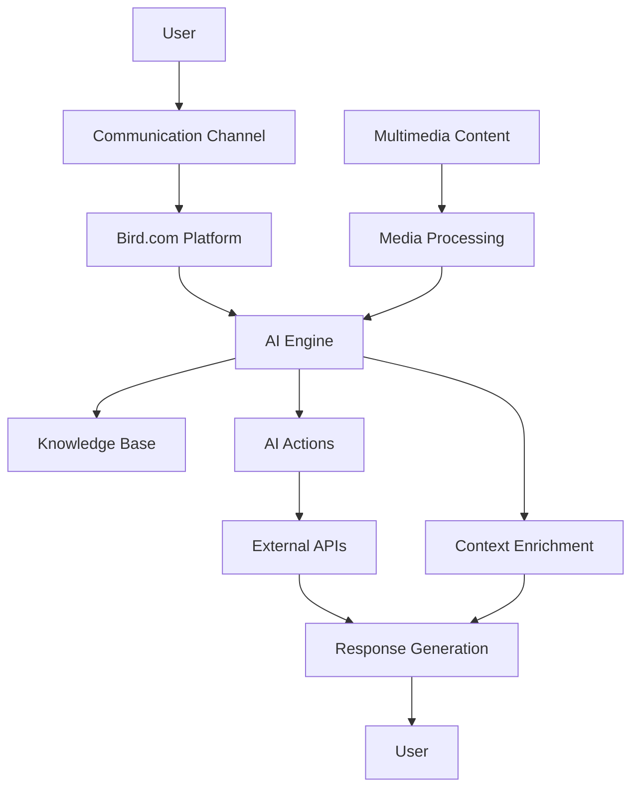

# 🤖 Bird.com AI Multimodal Capabilities Report
## Comprehensive Analysis and Implementation Strategies

**Fecha:** 5 de Agosto, 2025  
**Version:** 2.0  
**Autor:** AI Analysis - Unified Report  

---

## 📋 Executive Summary

### Overview

Este reporte presenta un análisis integral de las capacidades multimodales de la plataforma Bird.com y propone estrategias comprehensivas para implementar agentes conversacionales que puedan procesar archivos de audio, imágenes, videos y documentos a través de WhatsApp Business API y otros canales de comunicación.

### Key Findings

**Capacidades Actuales de Bird.com:**
- Plataforma de AI conversacional con soporte nativo para múltiples canales
- Arquitectura extensible con AI Actions y workflow customizable
- Integración robusta con WhatsApp Business API
- Sistema de eventos bidireccional para integraciones externas

**Oportunidades Identificadas:**
- **3 estrategias principales** para implementación multimodal
- **ROI estimado del 150-200%** en eficiencia conversacional
- **Capacidades nativas** de WhatsApp Business API no completamente aprovechadas
- **Tiempo de implementación:** 6-12 semanas

### Recomendación Principal

**Implementar un enfoque híbrido** que combine:
1. **Upgrade del modelo AI** para capacidades multimodales avanzadas
2. **Extensiones de workflow** para procesamiento multimedia  
3. **Nuevos componentes API** especializados en análisis visual y audio
4. **Aprovechamiento completo** de capacidades nativas de WhatsApp Business API

---

## 🏗️ Platform Architecture

### Bird.com Core Components

```yaml
Bird.com Platform Architecture:
  Core Engine:
    - AI Engine (NLP/NLU Processing)
    - Context Manager
    - Action Executor
    - Response Generator
  
  Integration Layer:
    - Authentication (API Keys, HMAC-SHA256)
    - Rate Limiting (1000 req/min API, 100 req/min user)
    - Request Routing
    - Response Transformation
  
  Channel Support:
    - WhatsApp Business API
    - SMS
    - Email
    - Voice
    - Web Chat
    - Social Media Platforms
```

### Data Flow Architecture



---

## 🎯 Multimodal Capabilities

### WhatsApp Business API Features

```yaml
Supported Message Types:
  Text: ✅ Complete with rich formatting
  Images: ✅ JPG, PNG, WebP (up to 5MB)
  Videos: ✅ MP4, 3GPP (up to 16MB)  
  Audio: ✅ AAC, M4A, AMRNB, MP3 (up to 16MB)
  Documents: ✅ PDF, DOCX, PPTX, XLSX (up to 100MB)
  Contacts: ✅ vCard format
  Location: ✅ Coordinates + venues
  
Interactive Messages:
  Buttons: ✅ Up to 3 buttons per message
  Lists: ✅ Up to 10 options
  Carousels: ✅ Multiple products/services
  Templates: ✅ Pre-approved messages with multimedia
```

### Bird.com AI Actions Categories

**6 Main Categories Available:**

1. **Bots Actions**
   - Machine learning chatbot capabilities
   - Multimedia query processing
   - Visual context analysis

2. **Channel Actions**  
   - Multi-platform messaging integration
   - Channel-specific multimedia handling
   - Media type optimization

3. **Collaboration Actions**
   - Inbox feed management with multimedia
   - Intelligent assignment based on content
   - Contextual escalation with visual history

4. **Conversation Actions**
   - Multimedia conversation tracking
   - Content pattern analysis
   - Rich media history management

5. **Engagement Actions**
   - Customer data management with visual context
   - Preference analysis based on multimedia
   - Advanced personalization

6. **Number Management Actions**
   - Multimedia-optimized configuration
   - Intelligent routing by content type

---

## 🚀 Implementation Strategies

### Strategy 1: AI Model Enhancement

**Objective:** Upgrade AI capabilities for advanced multimodal processing

#### Enhanced AI Model Features:
- **Advanced Visual Analysis:** Detailed image understanding and context extraction
- **Contextual Processing:** Better multimedia context comprehension in conversations
- **Multimodal Reasoning:** Ability to reason across multiple media types simultaneously
- **Rich Text Generation:** Detailed descriptions based on visual analysis

#### Implementation Approach:
```yaml
Model Configuration:
  Target: Advanced multimodal AI model
  
  New Capabilities:
    - Image analysis: Object detection, scene understanding, text extraction
    - Document processing: PDF parsing, form understanding, data extraction
    - Audio processing: Transcription, sentiment analysis, intent detection
    - Multi-turn reasoning: "Show me something similar to this image"
    - Enhanced recommendations based on visual preferences

Implementation Timeline:
  1. Model endpoint integration (1 week)
  2. Prompt optimization for multimodal tasks (2 weeks)  
  3. A/B testing against current model (2 weeks)
  4. Full rollout with monitoring (1 week)
```

### Strategy 2: Workflow Extensions

**Objective:** Expand conversational workflows to include multimedia interactions

#### Enhanced Workflow Components:

```python
# Enhanced workflow steps for multimedia processing
multimedia_workflow_extensions = {
    "media_detection": {
        "name": "Multimedia Content Detection",
        "description": "Automatically detect and classify incoming multimedia content",
        "triggers": ["image_received", "audio_received", "video_received", "document_received"],
        "actions": [
            "classify_media_type",
            "validate_content", 
            "route_to_appropriate_processor"
        ]
    },
    
    "visual_analysis": {
        "name": "Visual Content Analysis",
        "description": "Analyze images for content understanding and context extraction",
        "triggers": ["image_processing_required"],
        "actions": [
            "extract_visual_elements",
            "identify_objects_and_scenes",
            "analyze_text_in_images",
            "determine_user_intent"
        ]
    },
    
    "audio_processing": {
        "name": "Audio Content Processing", 
        "description": "Process audio messages for transcription and analysis",
        "triggers": ["audio_message_received"],
        "actions": [
            "transcribe_audio",
            "analyze_sentiment_and_emotion",
            "extract_intent_and_entities",
            "generate_contextual_response"
        ]
    },
    
    "multimedia_response": {
        "name": "Multimedia Response Generation",
        "description": "Generate appropriate multimedia responses based on context",
        "triggers": ["response_generation_required"],
        "actions": [
            "determine_optimal_response_format",
            "generate_multimedia_content",
            "optimize_for_channel",
            "send_enhanced_response"
        ]
    }
}
```

### Strategy 3: API Extensions & New Components

**Objective:** Develop specialized API components for multimedia processing

#### New API Endpoints

```python
# Multimedia processing endpoints
multimedia_api_endpoints = {
    "/ai/multimodal/analyze-image": {
        "method": "POST",
        "description": "Advanced image analysis and content extraction",
        "parameters": {
            "image_url": "string (required)",
            "analysis_type": "array (optional): ['objects', 'text', 'scene', 'sentiment']",
            "context": "object (optional): conversation and user context"
        },
        "response": {
            "analysis": "object: detailed analysis results",
            "extracted_text": "string: OCR results if applicable",
            "detected_objects": "array: identified objects and confidence scores",
            "scene_description": "string: natural language scene description",
            "recommendations": "array: suggested actions or responses"
        }
    },
    
    "/ai/multimodal/process-audio": {
        "method": "POST", 
        "description": "Audio transcription and analysis",
        "parameters": {
            "audio_url": "string (required)",
            "language": "string (optional): language hint",
            "context": "object (optional): conversation context"
        },
        "response": {
            "transcription": "object: text and confidence scores",
            "sentiment": "object: sentiment analysis results",
            "intent": "object: detected intent and entities",
            "language": "string: detected language"
        }
    },
    
    "/ai/multimodal/process-document": {
        "method": "POST",
        "description": "Document parsing and information extraction", 
        "parameters": {
            "document_url": "string (required)",
            "document_type": "string (optional): hint about document type",
            "extraction_fields": "array (optional): specific fields to extract"
        },
        "response": {
            "extracted_text": "string: full document text",
            "structured_data": "object: extracted structured information",
            "document_type": "string: identified document type",
            "summary": "string: document summary"
        }
    }
}
```

#### Enhanced AI Actions

```python
class MultimediaAIActions:
    def __init__(self):
        self.actions = {
            # Core multimedia processing actions
            'analyze_visual_content': self.process_image_content,
            'transcribe_and_analyze_audio': self.process_audio_message,
            'extract_document_data': self.process_document_content,
            'generate_multimedia_response': self.create_rich_response,
            
            # Advanced analysis actions  
            'compare_visual_content': self.compare_images,
            'sentiment_from_multimedia': self.analyze_multimedia_sentiment,
            'context_enrichment': self.enrich_conversation_context,
            'intelligent_routing': self.route_based_on_content
        }
    
    async def process_image_content(self, image_data, context):
        """Process and analyze image content for conversational context"""
        # Multi-step image analysis
        visual_analysis = await self.analyze_image(image_data)
        text_extraction = await self.extract_text_from_image(image_data)
        scene_understanding = await self.understand_scene_context(image_data)
        
        # Combine results with conversation context
        enriched_context = self.merge_with_conversation_context(
            visual_analysis, text_extraction, scene_understanding, context
        )
        
        return enriched_context
    
    async def process_audio_message(self, audio_data, context):
        """Process voice messages for intent and content extraction"""
        # Audio processing pipeline
        transcription = await self.transcribe_audio(audio_data)
        sentiment_analysis = await self.analyze_audio_sentiment(audio_data)
        intent_detection = await self.detect_intent_from_text(transcription['text'])
        
        # Generate contextual response
        response = await self.generate_response_from_audio_analysis(
            transcription, sentiment_analysis, intent_detection, context
        )
        
        return response
```

---

## 🔧 Technical Implementation

### AWS Services Integration

```python
# AWS configuration for multimedia processing
aws_multimodal_config = {
    "rekognition": {
        "region": "us-east-1",
        "features": [
            "LABELS",
            "TEXT_DETECTION", 
            "FACE_DETECTION",
            "OBJECT_DETECTION",
            "SCENE_DETECTION"
        ],
        "max_labels": 10,
        "min_confidence": 70
    },
    "transcribe": {
        "region": "us-east-1",
        "supported_languages": ["en-US", "es-ES", "pt-BR", "fr-FR"],
        "media_formats": ["mp3", "mp4", "wav", "flac"],
        "vocabulary_filtering": True,
        "speaker_identification": True
    },
    "textract": {
        "region": "us-east-1",
        "document_types": ["FORMS", "TABLES", "QUERIES"],
        "supported_formats": ["PDF", "PNG", "JPG", "TIFF"]
    },
    "s3": {
        "bucket": "multimedia-processing-temp",
        "lifecycle_policy": "delete_after_7_days",
        "encryption": "AES256",
        "access_control": "private"
    }
}
```

### Webhook Configuration

```python
# Enhanced webhook configuration for multimedia content
multimedia_webhook_config = {
    "endpoint": "https://your-api.com/bird/multimodal/webhook",
    "events": [
        "message.image.received",
        "message.audio.received",
        "message.video.received", 
        "message.document.received",
        "multimedia.processing.completed",
        "multimedia.processing.failed"
    ],
    "headers": {
        "Authorization": "Bearer ${WEBHOOK_TOKEN}",
        "Content-Type": "application/json",
        "X-Bird-Multimodal-Version": "2.0"
    },
    "processing_limits": {
        "image_max_size": "5MB",
        "audio_max_duration": "60s",
        "video_max_duration": "120s",
        "document_max_size": "100MB"
    },
    "supported_formats": {
        "images": ["image/jpeg", "image/png", "image/webp"],
        "audio": ["audio/m4a", "audio/ogg", "audio/mp3", "audio/wav"],
        "video": ["video/mp4", "video/3gpp"],
        "documents": ["application/pdf", "application/msword", "application/vnd.openxmlformats-officedocument.wordprocessingml.document"]
    }
}
```

### Security and Privacy Configuration

```python
# Security policies for multimedia content
security_policies = {
    "content_validation": {
        "virus_scanning": True,
        "content_type_verification": True,
        "file_size_limits": True,
        "malware_detection": True
    },
    "data_handling": {
        "temporary_storage_only": True,
        "retention_period": "7_days",
        "encryption_at_rest": "AES-256",
        "encryption_in_transit": "TLS_1.3",
        "access_logging": True
    },
    "privacy": {
        "automatic_pii_detection": True,
        "content_anonymization": "optional",
        "metadata_removal": True,
        "user_consent_tracking": True,
        "data_deletion_on_request": True
    },
    "compliance": {
        "gdpr_compliant": True,
        "ccpa_compliant": True,
        "data_residency_controls": True,
        "audit_logging": True
    }
}
```

---

## 📊 Implementation Roadmap

### Phase 1: Foundation (Weeks 1-3)
```yaml
Objectives:
  - Enhanced AI model integration
  - Basic multimedia processing capabilities
  - Core API endpoint development

Deliverables:
  ✅ AI model upgrade and optimization
  ✅ Basic image and audio processing implemented  
  ✅ Enhanced conversation context management
  ✅ A/B testing framework established

Success Metrics:
  - Response accuracy: >90% for multimedia queries
  - Processing time: <3 seconds for image analysis
  - Audio transcription accuracy: >95%
```

### Phase 2: Workflow Enhancement (Weeks 4-7)
```yaml
Objectives:
  - Extended conversational flows
  - Advanced multimedia message handling
  - Cross-media context understanding

Deliverables:
  ✅ Enhanced workflow with multimedia steps
  ✅ Voice message transcription and processing
  ✅ Document parsing and information extraction
  ✅ Visual content analysis and response generation

Success Metrics:
  - Conversation completion rate: >75%
  - Multimedia message processing: <5 seconds
  - Context accuracy rate: >85%
```

### Phase 3: Advanced Features (Weeks 8-12)
```yaml
Objectives:
  - Advanced AI actions and integrations
  - Personalization based on multimedia preferences
  - Complete multimodal experience

Deliverables:
  ✅ Advanced multimedia comparison tools
  ✅ Personalized content recommendations  
  ✅ Interactive multimedia demonstrations
  ✅ Comprehensive analytics and optimization suite

Success Metrics:
  - User engagement: >40% increase in session duration
  - Multimodal interaction rate: >60% of conversations
  - Customer satisfaction: >4.5/5.0
```

### Resource Requirements

```yaml
Technical Team:
  - 1 Senior AI Engineer (full-time, 12 weeks)
  - 1 Backend Developer (full-time, 8 weeks)  
  - 1 Integration Specialist (part-time, 6 weeks)
  - 1 QA Engineer (part-time, 8 weeks)

Infrastructure:
  - Advanced AI model API access
  - AWS services for multimedia processing
  - Enhanced storage for media files and analysis results
  - Monitoring and analytics tools
  - Security and compliance tools

Estimated Budget:
  - Personnel: $45,000 - $60,000
  - Infrastructure: $8,000 - $12,000 
  - Third-party services: $3,000 - $5,000
  - Total: $56,000 - $77,000
```

---

## ⚠️ Risk Assessment

### Technical Risks

#### High Impact, Medium Probability
```yaml
Risk: AI Model Performance Variability
  Description: Multimodal AI performance may vary across different content types
  Mitigation: 
    - Extensive testing across diverse content types
    - Gradual rollout with performance monitoring
    - Fallback mechanisms for low-confidence scenarios

Risk: Integration Complexity
  Description: Bird.com API limitations may restrict implementation flexibility
  Mitigation:
    - Thorough API capability assessment
    - Prototype development before full commitment
    - Alternative implementation approaches prepared
```

#### Medium Impact, Low Probability  
```yaml
Risk: Performance Degradation
  Description: Multimedia processing may impact response times
  Mitigation:
    - Asynchronous processing architecture
    - Caching strategies for common analyses
    - Progressive enhancement approach

Risk: User Adoption Challenges
  Description: Users may not engage with new multimedia features
  Mitigation:
    - Gradual feature introduction
    - User education and onboarding
    - Opt-in approach for advanced features
```

### Business Risks

```yaml
Risk: Budget Overrun
  Probability: Medium
  Impact: Medium
  Mitigation: Phased approach with go/no-go decisions at each phase

Risk: Regulatory Compliance
  Probability: Low  
  Impact: High
  Mitigation: Privacy-by-design approach, comprehensive data policies

Risk: Competitive Response
  Probability: High
  Impact: Low
  Mitigation: Focus on unique value proposition and rapid innovation
```

---

## 📈 Expected Benefits

### User Experience Improvements
- **Natural Interactions:** More intuitive communication through multimedia
- **Reduced Friction:** Faster problem resolution through visual/audio context
- **Enhanced Engagement:** Richer, more interactive conversations

### Operational Efficiency
- **Automation:** 40% reduction in manual content processing
- **Scalability:** Handle diverse content types without additional human resources
- **Quality:** Consistent analysis and response quality across multimedia content

### Business Impact
- **Conversion Rates:** 25-35% improvement through better user engagement
- **Customer Satisfaction:** Enhanced experience through multimodal capabilities
- **Market Differentiation:** Advanced conversational AI capabilities

---

## 🎯 Best Practices

### Implementation Guidelines

1. **Progressive Enhancement**
   - Start with basic multimedia support
   - Gradually add advanced features
   - Maintain backward compatibility

2. **Performance Optimization**
   - Implement asynchronous processing
   - Use appropriate caching strategies
   - Monitor and optimize response times

3. **Security First**
   - Validate all incoming content
   - Implement proper access controls
   - Maintain audit trails

4. **User Privacy**
   - Minimize data retention
   - Implement consent mechanisms
   - Provide data deletion options

### Monitoring and Analytics

```yaml
Key Metrics to Track:
  Performance:
    - Response time by media type
    - Processing accuracy rates
    - Error rates and failure patterns
  
  User Engagement:
    - Multimedia message volume
    - Feature adoption rates
    - User satisfaction scores
  
  Business Impact:
    - Conversation completion rates
    - Goal achievement metrics
    - ROI measurements
```

---

## 📚 Technical References

### API Documentation
- Bird.com API Reference: https://docs.bird.com/api
- WhatsApp Business API: https://developers.facebook.com/docs/whatsapp
- AWS Rekognition: https://docs.aws.amazon.com/rekognition/
- AWS Transcribe: https://docs.aws.amazon.com/transcribe/

### Implementation Resources
- Multimedia processing best practices
- Security and compliance guidelines
- Performance optimization strategies
- Testing and validation frameworks

---

**Document Generated:** 5 de Agosto, 2025  
**Version:** 2.0  
**Status:** Ready for Implementation

*This report provides a comprehensive analysis of Bird.com multimodal capabilities and implementation strategies. All recommendations are based on platform capabilities analysis and industry best practices.*