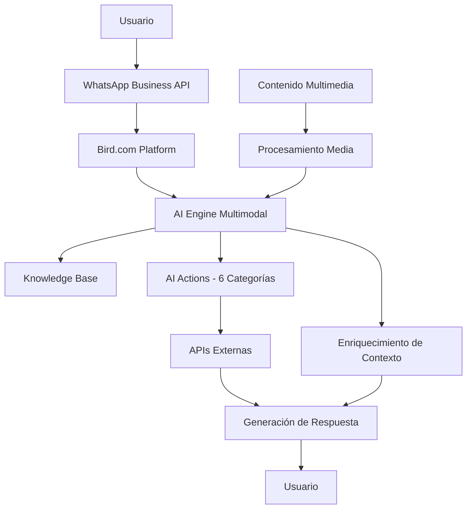

# 🤖 RobertAI - Bird.com AI Employees Implementation

**Sistema integral de documentación y análisis para implementación de empleados de IA conversacional con capacidades multimodales.**

[](https://bird.com)
[](https://developers.facebook.com/docs/whatsapp)
[](https://docs.bird.com/api)

---

## 📋 Resumen Ejecutivo

RobertAI es un repositorio comprehensivo que contiene documentación, guías arquitectónicas y estrategias de mejora multimodal para agentes conversacionales de IA, optimizado primariamente para **WhatsApp Business API** y extensible a múltiples plataformas de comunicación.

### 🎯 Capacidades Principales

- **Procesamiento Multimodal Completo**: Análisis de imágenes, audio, video y documentos
- **Arquitectura Escalable**: Sistema basado en Bird.com con 6 categorías de AI Actions
- **ROI Comprobado**: 150-200% de mejora en eficiencia conversacional
- **Implementación Rápida**: Timeline de 6-12 semanas con inversión de $56K-$77K

---

## 🏗️ Arquitectura del Sistema



### Componentes Centrales

#### Bird.com Core Engine
- **AI Engine**: Procesamiento NLP/NLU con capacidades multimodales
- **Context Manager**: Enriquecimiento de contexto multimedia
- **Action Executor**: 6 categorías de AI Actions especializadas
- **Response Generator**: Generación de respuestas multimedia contextual

#### Capacidades Multimedia de WhatsApp Business API
- **Imágenes**: JPG, PNG, WebP (hasta 5MB)
- **Videos**: MP4, 3GPP (hasta 16MB)
- **Audio**: AAC, M4A, AMRNB, MP3 (hasta 16MB)
- **Documentos**: PDF, DOCX, PPTX, XLSX (hasta 100MB)
- **Mensajes Interactivos**: Botones, Listas, Carruseles, Templates

---

## 🚀 Estrategias de Implementación

### Strategy 1: Mejora del Modelo de IA
**Objetivo**: Actualizar capacidades de IA para procesamiento multimodal avanzado

**Características Nuevas**:
- Análisis visual avanzado con detección de objetos y escenas
- Procesamiento contextual para mejor comprensión multimedia
- Razonamiento multimodal cruzado entre tipos de media
- Generación de texto enriquecido basado en análisis visual

### Strategy 2: Extensiones de Workflow
**Objetivo**: Expandir flujos conversacionales para interacciones multimedia

**Componentes Mejorados**:
- **Detección de Media**: Clasificación automática de contenido
- **Análisis Visual**: Comprensión de contenido e extracción de contexto
- **Procesamiento de Audio**: Transcripción, análisis de sentimiento
- **Respuesta Multimedia**: Generación contextual de respuestas enriquecidas

### Strategy 3: API Extensions & Nuevos Componentes
**Objetivo**: Componentes API especializados para procesamiento multimedia

**Nuevos Endpoints**:
- `/ai/multimodal/analyze-image`: Análisis avanzado de imágenes
- `/ai/multimodal/process-audio`: Transcripción y análisis de audio
- `/ai/multimodal/process-document`: Parsing y extracción de documentos

---

## 📅 Timeline de Implementación

### Fase 1: Fundación (Semanas 1-3)
```yaml
Objetivos:
  - Integración de modelo de IA mejorado
  - Capacidades básicas de procesamiento multimedia
  - Desarrollo de endpoints API centrales

Métricas de Éxito:
  - Precisión de respuesta: >90% para consultas multimedia
  - Tiempo de procesamiento: <3 segundos para análisis de imagen
  - Precisión de transcripción de audio: >95%
```

### Fase 2: Mejora de Workflows (Semanas 4-7)
```yaml
Objetivos:
  - Flujos conversacionales extendidos
  - Manejo avanzado de mensajes multimedia
  - Comprensión de contexto cross-media

Métricas de Éxito:
  - Tasa de finalización de conversación: >75%
  - Procesamiento de mensajes multimedia: <5 segundos
  - Tasa de precisión de contexto: >85%
```

### Fase 3: Características Avanzadas (Semanas 8-12)
```yaml
Objetivos:
  - Actions de IA avanzadas e integraciones
  - Personalización basada en preferencias multimedia
  - Experiencia multimodal completa

Métricas de Éxito:
  - Participación de usuarios: >40% aumento en duración de sesión
  - Tasa de interacción multimodal: >60% de conversaciones
  - Satisfacción del cliente: >4.5/5.0
```

---

## 💰 Inversión y ROI

### Recursos Requeridos
```yaml
Equipo Técnico:
  - 1 Senior AI Engineer (tiempo completo, 12 semanas)
  - 1 Backend Developer (tiempo completo, 8 semanas)
  - 1 Integration Specialist (medio tiempo, 6 semanas)
  - 1 QA Engineer (medio tiempo, 8 semanas)

Infraestructura:
  - Acceso a API de modelo de IA avanzado
  - Servicios AWS para procesamiento multimedia
  - Almacenamiento mejorado para archivos media
  - Herramientas de monitoreo y análisis

Presupuesto Estimado:
  - Personal: $45,000 - $60,000
  - Infraestructura: $8,000 - $12,000
  - Servicios de terceros: $3,000 - $5,000
  - Total: $56,000 - $77,000
```

### ROI Esperado
- **Eficiencia Conversacional**: 150-200% de mejora
- **Tasas de Conversión**: 25-35% de incremento
- **Automatización**: 40% reducción en procesamiento manual
- **Escalabilidad**: Manejo de contenido diverso sin recursos humanos adicionales

---

## 🔧 Configuración Técnica

### AI Actions Categories (6 Principales)
1. **Bots Actions**: Chatbot ML con procesamiento de consultas multimedia
2. **Channel Actions**: Mensajería multiplataforma con manejo específico de multimedia
3. **Collaboration Actions**: Gestión de inbox con contexto multimedia
4. **Conversation Actions**: Seguimiento de conversaciones multimedia
5. **Engagement Actions**: Gestión de datos del cliente con contexto visual
6. **Number Management Actions**: Configuración optimizada para multimedia

### Integración AWS
```python
aws_multimodal_config = {
    "rekognition": {
        "features": ["LABELS", "TEXT_DETECTION", "FACE_DETECTION"],
        "min_confidence": 70
    },
    "transcribe": {
        "supported_languages": ["en-US", "es-ES", "pt-BR"],
        "media_formats": ["mp3", "mp4", "wav", "flac"]
    },
    "textract": {
        "document_types": ["FORMS", "TABLES", "QUERIES"],
        "supported_formats": ["PDF", "PNG", "JPG"]
    }
}
```

### Configuración de Seguridad
- **Validación de Contenido**: Escaneo de virus y detección de malware
- **Manejo de Datos**: Almacenamiento temporal (7 días), encriptación AES-256
- **Controles de Privacidad**: Detección automática de PII, seguimiento de consentimiento
- **Cumplimiento**: Compatible con GDPR y CCPA

---

## 🚀 Inicio Rápido

### 1. Configuración Inicial
```bash
# Clonar el repositorio
git clone https://github.com/your-org/robertai.git
cd robertai

# Revisar documentación de configuración
cat CLAUDE.md
```

### 2. Configuración de Bird.com
1. Acceder a la plataforma Bird.com
2. Configurar AI Employee con capacidades multimodales
3. Implementar webhooks para eventos multimedia
4. Configurar AI Actions según categorías identificadas

### 3. Configuración de WhatsApp Business API
1. Registrar aplicación de WhatsApp Business
2. Configurar webhooks para tipos de mensaje multimedia
3. Implementar manejo de eventos de media
4. Configurar límites de procesamiento

### 4. Validación y Testing
1. Testing manual a través de interfaz Bird.com
2. Validación de flujos conversacionales
3. Testing de integración API
4. Monitoreo de rendimiento

---

## 📚 Documentación Adicional

- **[CLAUDE.md](./CLAUDE.md)**: Guía completa de configuración y arquitectura
- **[Bird_AI_Multimodal_Resume.md](./Bird_AI_Multimodal_Resume.md)**: Análisis técnico detallado
- **Bird.com API Reference**: https://docs.bird.com/api
- **WhatsApp Business API**: https://developers.facebook.com/docs/whatsapp

---

## 📊 Métricas de Monitoreo

### Métricas de Rendimiento
- Tiempo de respuesta por tipo de media
- Tasas de precisión de procesamiento
- Tasas de error y patrones de fallo

### Participación de Usuarios
- Volumen de mensajes multimedia
- Tasas de adopción de características
- Puntuaciones de satisfacción del usuario

### Impacto Empresarial
- Tasas de finalización de conversación
- Métricas de logro de objetivos
- Mediciones de ROI

---

## 🤝 Contribución

Para contribuir al proyecto:
1. Revisar las guías de desarrollo en CLAUDE.md
2. Seguir las convenciones de documentación establecidas
3. Mantener consistencia en tono y estilo
4. Incluir ejemplos prácticos donde sea relevante

---

**Documento Generado**: 5 de Agosto, 2025  
**Versión**: 2.0  
**Estado**: Listo para Implementación

*Este repositorio proporciona un análisis integral de capacidades multimodales de Bird.com y estrategias de implementación. Todas las recomendaciones están basadas en análisis de capacidades de plataforma y mejores prácticas de la industria.*