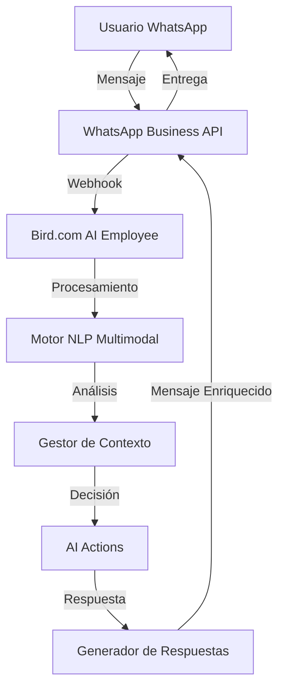

# WhatsApp Business API - Introducción y Visión General

## ¿Qué es WhatsApp Business API?

WhatsApp Business API es la solución empresarial de WhatsApp que permite a las organizaciones comunicarse con sus clientes de manera programática y escalable. Como **canal principal** en el ecosistema RobertAI, proporciona la base para implementaciones de Bird.com AI Employees con capacidades multimodales avanzadas.

## Capacidades Principales

### 1. Mensajería Multimedia Nativa

```yaml
Formatos Soportados:
  Imágenes:
    - Formatos: JPEG, PNG, WebP
    - Tamaño máximo: 5MB
    - Resolución recomendada: 1080x1080px
  
  Videos:
    - Formatos: MP4, 3GPP
    - Tamaño máximo: 16MB
    - Duración máxima: 90 segundos
  
  Audio:
    - Formatos: AAC, M4A, AMRNB, MP3, OGG
    - Tamaño máximo: 16MB
    - Duración máxima: 16 minutos
  
  Documentos:
    - Formatos: PDF, DOC, DOCX, PPT, PPTX, XLS, XLSX
    - Tamaño máximo: 100MB
```

### 2. Mensajes Interactivos

#### Botones de Acción Rápida
```json
{
  "type": "interactive",
  "interactive": {
    "type": "button",
    "body": {
      "text": "¿En qué puedo ayudarte hoy?"
    },
    "action": {
      "buttons": [
        {
          "type": "reply",
          "reply": {
            "id": "info_productos",
            "title": "Ver Productos"
          }
        },
        {
          "type": "reply",
          "reply": {
            "id": "soporte_tecnico",
            "title": "Soporte Técnico"
          }
        },
        {
          "type": "reply",
          "reply": {
            "id": "hablar_agente",
            "title": "Hablar con Agente"
          }
        }
      ]
    }
  }
}
```

#### Listas Interactivas
```json
{
  "type": "interactive",
  "interactive": {
    "type": "list",
    "header": {
      "type": "text",
      "text": "Nuestros Servicios"
    },
    "body": {
      "text": "Selecciona el servicio que te interesa:"
    },
    "footer": {
      "text": "Powered by RobertAI"
    },
    "action": {
      "button": "Ver Opciones",
      "sections": [
        {
          "title": "Servicios Principales",
          "rows": [
            {
              "id": "consultoria_ai",
              "title": "Consultoría AI",
              "description": "Implementación de soluciones de inteligencia artificial"
            },
            {
              "id": "desarrollo_custom",
              "title": "Desarrollo Custom",
              "description": "Soluciones personalizadas para tu negocio"
            }
          ]
        }
      ]
    }
  }
}
```

### 3. Plantillas de Mensaje Empresariales

Las plantillas permiten enviar notificaciones proactivas y deben ser pre-aprobadas por Meta:

```json
{
  "type": "template",
  "template": {
    "name": "bienvenida_usuario",
    "language": {
      "code": "es"
    },
    "components": [
      {
        "type": "header",
        "parameters": [
          {
            "type": "text",
            "text": "{{nombre_usuario}}"
          }
        ]
      },
      {
        "type": "body",
        "parameters": [
          {
            "type": "text",
            "text": "{{empresa}}"
          },
          {
            "type": "text",
            "text": "{{fecha_registro}}"
          }
        ]
      }
    ]
  }
}
```

## Arquitectura de Integración

### Flujo de Datos Principal



### Componentes de la Arquitectura

#### 1. Capa de Comunicación (WhatsApp Business API)
- **Recepción de mensajes**: Procesamiento en tiempo real de todos los tipos de mensaje
- **Webhook delivery**: Entrega confiable de eventos con retry automático
- **Rate limiting**: Gestión inteligente de límites de API (1000 req/min)
- **Message queuing**: Cola de mensajes para procesamiento asíncrono

#### 2. Capa de Procesamiento AI (Bird.com)
- **Motor NLP avanzado**: Comprensión de texto con contexto multimedia
- **Análisis visual**: Procesamiento de imágenes con OCR y reconocimiento de objetos
- **Procesamiento de audio**: Transcripción y análisis de sentimientos
- **Gestión de contexto**: Memoria conversacional enriquecida con multimedia

#### 3. Capa de Integración Empresarial
- **APIs REST**: Integración con sistemas CRM, ERP y bases de datos
- **Webhooks bidireccionales**: Sincronización en tiempo real
- **Event streaming**: Procesamiento de eventos para analytics
- **Security layer**: Autenticación, autorización y encriptación

## Ventajas como Canal Principal

### 1. Adopción Masiva de Usuarios
- **2.7 mil millones** de usuarios activos globalmente
- **Tasa de apertura del 98%** en mensajes empresariales
- **Respuesta promedio en 5 minutos** vs 90 minutos en email
- **Familiaridad de interfaz** para usuarios finales

### 2. Capacidades Técnicas Superiores
- **Rich media support** nativo sin limitaciones
- **End-to-end encryption** para seguridad empresarial
- **Delivery receipts** y confirmaciones de lectura
- **Status updates** en tiempo real

### 3. Integración Empresarial Robusta
- **Webhook reliability** con 99.9% de uptime
- **Comprehensive APIs** para todas las funcionalidades
- **Scalable infrastructure** que soporta millones de mensajes
- **Global coverage** en más de 180 países

### 4. Rentabilidad y ROI
- **Costo por interacción**: 65% menor que llamadas telefónicas
- **Tiempo de resolución**: 40% más rápido que email
- **Satisfacción del cliente**: 89% de satisfaction rate
- **Conversión**: 3-5x mejor que otros canales digitales

## Casos de Uso Principales

### 1. Atención al Cliente Automatizada
```python
# Ejemplo: Respuesta automática con análisis de imagen
@webhook_handler("message.image.received")
async def handle_product_inquiry(message):
    # Análisis de imagen del producto
    image_analysis = await analyze_product_image(message.image.url)
    
    # Búsqueda en catálogo
    product_match = await search_product_catalog(image_analysis.features)
    
    if product_match:
        response = create_product_info_message(product_match)
        await send_whatsapp_message(message.from, response)
    else:
        await escalate_to_human_agent(message)
```

### 2. Ventas y Lead Generation
```python
# Ejemplo: Flujo de calificación de leads
@webhook_handler("interactive.button.reply")
async def handle_lead_qualification(interaction):
    if interaction.button_reply.id == "solicitar_demo":
        # Iniciar flujo de calificación
        qualification_flow = LeadQualificationFlow()
        await qualification_flow.start(interaction.from)
        
        # Integrar con CRM
        await crm_client.create_lead({
            "whatsapp_id": interaction.from,
            "source": "whatsapp_bot",
            "status": "qualified",
            "timestamp": datetime.now()
        })
```

### 3. Notificaciones Proactivas
```python
# Ejemplo: Notificación de entrega con tracking
async def send_delivery_notification(order_id, customer_phone):
    template_data = {
        "name": "entrega_pedido",
        "language": {"code": "es"},
        "components": [
            {
                "type": "body",
                "parameters": [
                    {"type": "text", "text": order_id},
                    {"type": "text", "text": get_tracking_url(order_id)}
                ]
            }
        ]
    }
    
    await send_template_message(customer_phone, template_data)
```

## Métricas y KPIs

### Métricas de Rendimiento
```yaml
Response Times:
  - Mensaje de texto: <500ms
  - Análisis de imagen: <3s
  - Procesamiento de audio: <5s
  - Consulta a API externa: <2s

Success Rates:
  - Entrega de mensajes: >99.5%
  - Procesamiento de webhook: >99.9%
  - Análisis multimedia: >95%
  - Escalación exitosa: >98%

Engagement Metrics:
  - Tasa de respuesta: >85%
  - Tiempo de resolución: <10 min promedio
  - Satisfacción del cliente: >4.5/5
  - Retención de conversación: >75%
```

### ROI Esperado
- **Reducción de costos operativos**: 35-45%
- **Incremento en conversiones**: 25-35%
- **Mejora en satisfacción del cliente**: 40-50%
- **Tiempo de implementación**: 4-6 semanas

## Próximos Pasos

1. **Configurar autenticación**: Seguir la [guía de autenticación](02-authentication.md)
2. **Implementar webhooks**: Configurar [eventos de webhook](04-webhook-events.md)
3. **Probar tipos de mensaje**: Implementar [mensajes multimedia](03-message-types.md)
4. **Integrar con Bird.com**: Configurar [AI Employee](06-bird-integration.md)

---

**Documentación técnica**: Esta guía forma parte del ecosistema RobertAI para implementación de Bird.com AI Employees con WhatsApp Business API como canal principal.